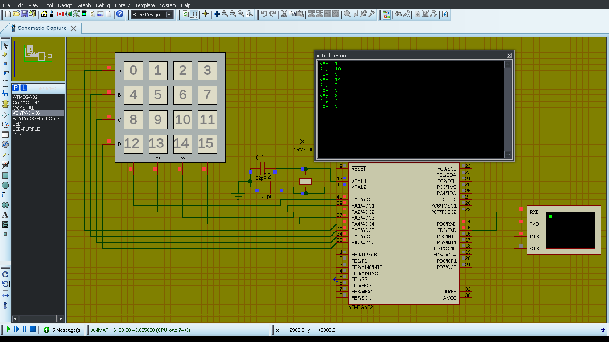

# avr_keypad_4x4_library
A library for interfacing a 4x4 matrix keypad to AVR microcontrollers

## The makefile of this project uses Code::Blocks to build the project
## Either install Code::Blocks or use your own makefile for building the project
